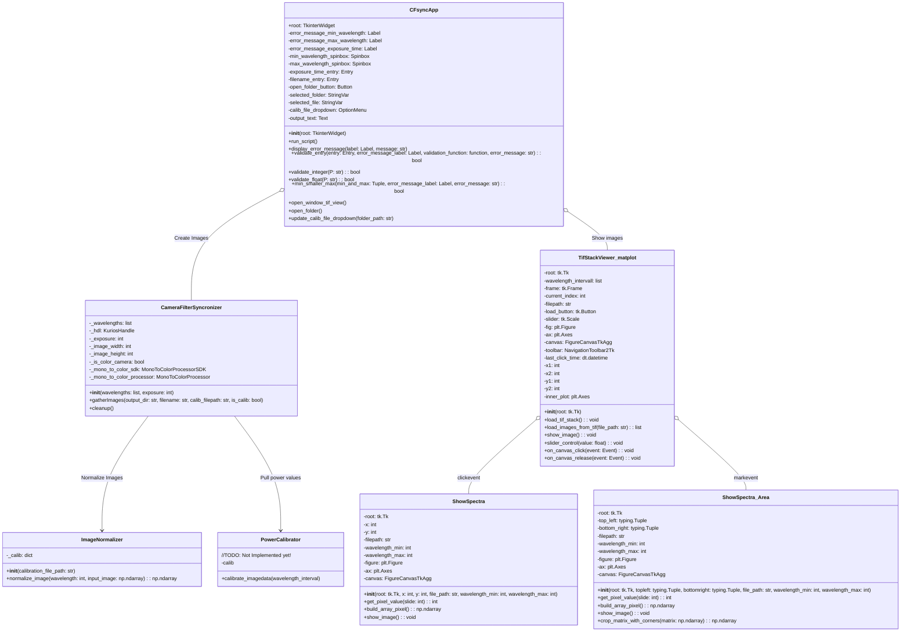
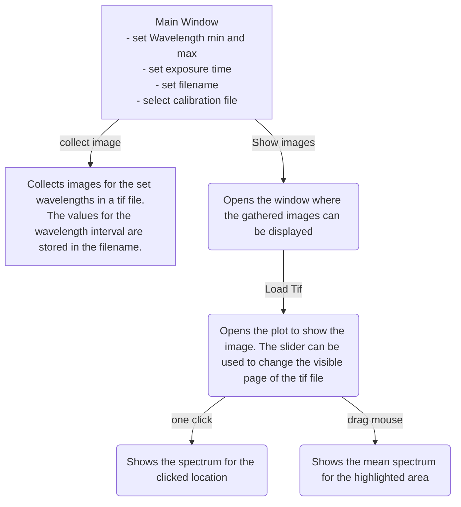
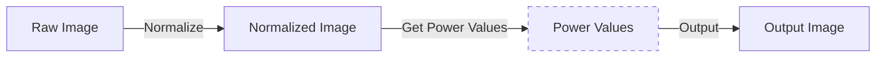

# Microscope_Automization
A Microscope Automatization Project by Jan-Niklas Topf and Frederick Krafft 

Documentation: [Documentation](./html/index.html)
## Class Diagram 
The project structure is visualized in the following class diagram:

Note that the Power Calibrator is not implemented yet and would be necessary to establish a relation between the intensity captured by the camera and the total incident/reflected power distribution.
## GUI Usage 

The main graphical user interface offers the initialization of a new measurement series using the Synchronizer and displaying existing data in a Viewer subroutine. The user flow is visualized in the following:

## Image Processing
The synchronizer useses reference intensity data to normalize the images, which was captured using a reference white scattering sample as the target. Thus the data is displayed in a relative scale to the corresponding incident flux density. After the normalization one could implement a power calibrator, which would put the captured intensity on the camera in relation to the total incident power. The flow can be visualized as following (Power calibrator not implemented!):

