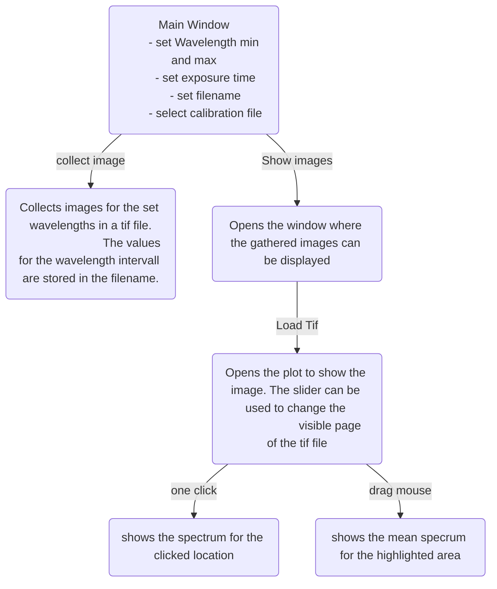

# Microscope_Automization
A Microscope Automatization Project of Jan Niklas Topf and Frederick Krafft 
## Class Diagram 
The project structure is visualized in the following class diagram:

## GUI Usage 

The main graphical user interface offers the initialization of a new measurement series using the Synchronizer and displaying existing data in a Viewer subroutine. The user flow is visualized in the following:

